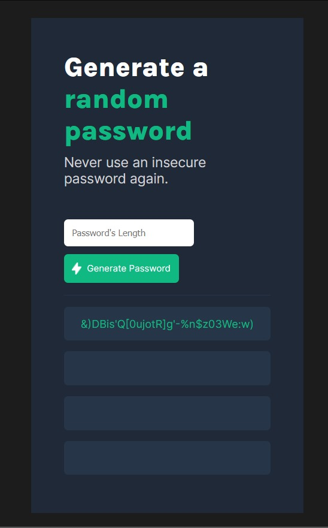
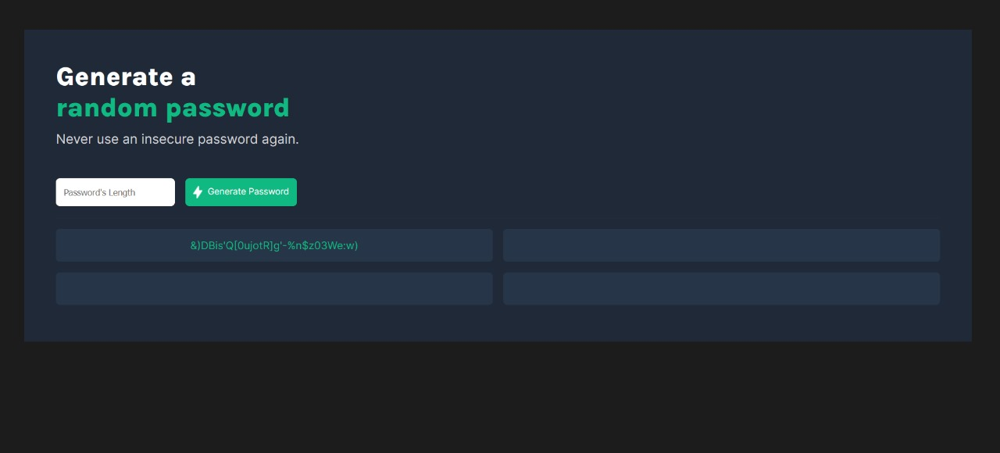

# Random Password Generator 

This is a simple random password generator app created using HTML, CSS, and JavaScript. The app allows users to specify the length of the password they want (ranging from 8 to 30 characters) and generates four random passwords of the desired length. Users can then click on any generated password to copy it to the clipboard for easy use.

## Features

- Generate four random passwords simultaneously.
- The user can specify the desired length of the password (between 8 and 30 characters).
- Click-to-copy functionality makes it easy to use the generated passwords.
- Simple and intuitive user interface.

## Live Demo

You can try the live demo of the app [here](https://random-password-generator-eight-delta.vercel.app/). 

## Screenshots

### Mobile View

### Web View

## Usage

1. Open the app in your web browser.
2. Specify the desired password length using the provided input field.
3. Click on the "Generate Password" button.
4. Four random passwords of the specified length will be generated.
5. Click on any generated password to copy it to the clipboard.

## Contributing

Contributions are welcome! If you find any bugs or have suggestions for improvements, feel free to open an issue or submit a pull request.

